# GitHub Codespaces Quick Start Guide

Welcome to the ML Pipeline Project Codespace! This guide will help you get started in 5 minutes.

## Quick Decision Guide

**Choose your path:**

- **First time here?** → Start with "First Time Setup" below
- **Environment not working?** → Jump to "Common Issues"
- **Ready to start coding?** → Go to "Working with the Project"
- **Need help with specific tasks?** → See "Student Implementation Tasks"
- **Running out of credits?** → Check "Free Tier Limits"
- **Want to save your work?** → See "Saving Your Work" in Tips & Best Practices

### Your Learning Journey

```mermaid
flowchart LR
    A[1. Setup<br/>Create + Configure] --> B[2. Implement<br/>Code + Test + Debug]
    B --> C{All tasks<br/>done?}
    C -->|No| B
    C -->|Yes| D[Done! 🎉]

    style A fill:#e1f5e1
    style B fill:#e3f2fd
    style D fill:#ffd700
```



**That's it. Three steps:**

1. **Setup** (once, 10 min): Create codespace → Add W&B key → Rebuild
2. **Implement tasks** (repeat): Implement pipeline step → Test → Debug → Iterate
3. **Done**: Complete all pipeline components and run end-to-end

**Pro tip**: One codespace is enough for the entire project. Use git branches to save your work.

---

## First Time Setup

### 1. Create Your Codespace

#### Choosing Your Branch

Before creating your codespace, you need to choose which branch to work from:

**Recommended Options:**

| Branch | When to Use | Best For |
|--------|-------------|----------|
| **`master`** | Starting fresh, following course exercises | Most students - stable, tested infrastructure |
| **`main`** | If this is the default branch | Alternative to master (some repos use main) |
| **Feature branch** | Working on specific improvements or experiments | Advanced users testing new features |


**How to Create:**

1. Navigate to the repository on GitHub
2. **Important**: First select your desired branch using the branch dropdown (top-left, usually shows "main")
3. Click the green **"Code"** button
4. Select the **"Codespaces"** tab
5. Click **"Create codespace on [branch-name]"**
   - The button will show the currently selected branch
   - Double-check this matches your intended branch before clicking

**First-time Setup Time:**
- With prebuild: ~30-60 seconds
- Without prebuild: ~2-3 minutes
- The environment will auto-configure with Python 3.12.7, conda, MLflow, and W&B

**Pro Tips:**

- **For project work**: Use `main` branch - it has all infrastructure fixes and stable dependencies
- **Switch branches later**: You can change branches inside the codespace without recreating it (saves time and credits)
- **Save your work**: Create your own branch for implementations rather than working directly on main

#### Switching Branches After Creation

You don't need to create a new codespace to work on a different branch. To switch branches in your existing codespace:

**Using VS Code UI:**
1. Click the branch name in the bottom-left status bar
2. Select the branch you want from the dropdown
3. Wait for files to update (a few seconds)

**Using Terminal:**
```bash
git fetch origin                    # Get latest branches
git checkout <branch-name>          # Switch to branch
git checkout main                   # Back to main
git checkout -b my-implementation   # Create new branch
```

**When to switch vs. create new:**

- **Switch branches**: Working on different features, comparing implementations, testing
- **Create new codespace**: Need a completely fresh environment, working on isolated project

### 2. Add Your Weights & Biases API Key

**Important**: This project requires W&B authentication.

1. Get your **v1 API key** from [https://wandb.ai/authorize](https://wandb.ai/authorize)
   - New keys have format: `wandb_v1_...` (86 characters)
   - Legacy 40-character keys are being phased out
2. In GitHub, go to **Settings** → **Codespaces** → **Secrets**
3. Click **New secret**:
   - **Name**: `WANDB_API_KEY`
   - **Value**: [paste your full v1 API key]
   - **Repository access**: Select this repository
4. **Rebuild your Codespace**: Press `Cmd+Shift+P` (Mac) or `Ctrl+Shift+P` (Windows), type "Rebuild Container", and press Enter

**Note:** This repository uses wandb 0.24.0, which supports the new secure v1 API key format.

### 3. Verify Setup

After rebuild, check the terminal output. You should see:
```
✓ WANDB_API_KEY found
✓ W&B login successful!
```

---

## Terminal Setup

### Default Shell
This Codespace uses **Zsh** as the default shell with Oh My Zsh for enhanced functionality.

### Conda Environment Auto-Activation
The `nyc_airbnb_dev` conda environment is configured to auto-activate in new terminals.

**What you'll see when opening a new terminal:**
```
==========================================
  NYC Airbnb ML Pipeline - Codespace
==========================================

Environment: Python 3.12.7, MLflow 3.3.2
Disk Space: XXG available

Quick Start:
  mlflow run . -P steps=download
  mlflow run . -P steps=basic_cleaning
  mlflow run .

Docs: README.md | CODESPACES_QUICKSTART.md
```

**Verify your environment:**
```bash
# Check active environment (should show * next to nyc_airbnb_dev)
conda env list

# Verify Python version (should be 3.12.7)
python --version

# Verify MLflow version (should be 3.3.2)
mlflow --version
```

**If auto-activation doesn't work:**
Manually activate the environment in each new terminal:
```bash
conda activate nyc_airbnb_dev
```

### Environment Details

- **Name**: `nyc_airbnb_dev`
- **Python**: 3.12.7
- **Key Packages**: MLflow 3.3.2, W&B 0.24.0, pandas 2.3.2, scikit-learn 1.7.2
- **Location**: `/opt/conda/envs/nyc_airbnb_dev`

---

## Working with the Project

### Project Structure

This is an MLflow-based ML pipeline for predicting NYC short-term rental prices. The pipeline has 6 main steps:

1. **download** - Fetches raw data sample (pre-built component)
2. **basic_cleaning** - Removes outliers, handles dates (**student implements**)
3. **data_check** - pytest-based data validation (**student completes**)
4. **data_split** - Segregates test set (pre-built component)
5. **train_random_forest** - Trains RF model (**student completes**)
6. **test_regression_model** - Tests production model (pre-built component)

### Quick Start Workflow

#### Run Pre-Built Steps
```bash
# Download data (works immediately)
mlflow run . -P steps=download
```

#### Implement Required Components

**⚠️ IMPORTANT:** Before running the full pipeline, you must complete the student implementation tasks!

See "Student Implementation Tasks" section below for detailed instructions.

#### Run Specific Steps
```bash
# Single step
mlflow run . -P steps=download

# Multiple steps
mlflow run . -P steps=download,basic_cleaning

# Override config parameters using Hydra syntax
mlflow run . \
  -P steps=train_random_forest \
  -P hydra_options="modeling.random_forest.n_estimators=100 etl.min_price=50"
```

#### Run Full Pipeline (After Implementation)
```bash
# Execute all steps end-to-end
mlflow run .
```

#### Hyperparameter Optimization
```bash
# Multi-run with Hydra (-m flag)
mlflow run . \
  -P steps=train_random_forest \
  -P hydra_options="modeling.max_tfidf_features=10,15,30 modeling.random_forest.max_features=0.1,0.33,0.5 -m"
```

#### Test Production Model
```bash
# Must manually tag a model as "prod" in W&B first
mlflow run . -P steps=test_regression_model
```

---

## Common Issues

### "WANDB_API_KEY not set"
**Problem**: W&B authentication failed
**Solution**:
1. Check if you added the secret to GitHub Codespaces (Settings → Codespaces → Secrets)
2. Make sure the secret name is exactly `WANDB_API_KEY`
3. Rebuild your container (`Cmd+Shift+P` → "Rebuild Container")

### "conda: command not found"
**Problem**: Conda not activated
**Solution**: The base environment should activate automatically. If not:
```bash
source /opt/conda/etc/profile.d/conda.sh
conda activate nyc_airbnb_dev
```

### "Disk space full"
**Problem**: Too many conda environments created by MLflow
**Solution**: Run the cleanup script:
```bash
bash .devcontainer/scripts/cleanup-mlflow-envs.sh
```
Or use the VS Code task: `Cmd+Shift+P` → "Tasks: Run Task" → "Cleanup MLflow Environments"

### "Attempted to fetch artifact without alias"
**Problem**: Missing version tag on artifact reference
**Solution**: Always specify artifact versions/tags:
- Use `:latest` or `:reference` or `:prod` tag
- Example: `sample.csv:latest` NOT `sample.csv`

### "No module named 'basic_cleaning'"
**Problem**: Haven't created the basic_cleaning directory yet
**Solution**: Follow Task 1 in "Student Implementation Tasks" to create the component with cookiecutter

### Slow execution / timeouts

**Problem**: Codespace resource constraints or first-run environment creation
**Solution**:

- **First run**: MLflow creates conda environments for each step (~5 minutes total). Subsequent runs reuse environments (~30 seconds)
- **Resource constraints**:
  - Close unused browser tabs
  - Stop unnecessary processes
  - Upgrade to 4-core machine for hyperparameter sweeps (Codespace menu → "Change machine type")
- See "Free Tier Limits" section for machine type recommendations

### "Your local changes would be overwritten by checkout"

**Problem**: Trying to switch branches with uncommitted changes
**Solution**:

```bash
# Option 1: Save your work (recommended)
git add .
git commit -m "Work in progress on basic_cleaning"
git checkout <target-branch>

# Option 2: Stash changes temporarily
git stash
git checkout <target-branch>
# Later, return and restore:
git checkout <original-branch>
git stash pop

# Option 3: Discard changes (use with caution!)
git checkout -- .
git checkout <target-branch>
```

### Wrong branch / Need to start over

**Problem**: Created codespace on wrong branch or environment is corrupted
**Solution**:

```bash
# Check current branch
git branch

# Switch to correct branch
git checkout main

# If environment is corrupted, recreate it
conda env remove --name nyc_airbnb_dev
conda env create -f environment.yml
conda activate nyc_airbnb_dev
```

Or simply delete the codespace and create a new one from the correct branch.

---

## VS Code Tasks

Access via `Cmd+Shift+P` → "Tasks: Run Task":

- **Cleanup MLflow Environments**: Free up disk space
- **Run MLflow Project**: Run `mlflow run .` (default task)
- **Run Specific Step**: Run individual pipeline steps
- **Start Jupyter Lab**: Launch Jupyter for EDA

---

## Viewing Results

### MLflow UI
When you run `mlflow run .`, the MLflow UI becomes available:
1. Check the "Ports" tab in VS Code (bottom panel)
2. Click on the "MLflow UI" link (port 5000)
3. View experiments, parameters, metrics, and artifacts

### Weights & Biases
1. Go to [https://wandb.ai](https://wandb.ai)
2. Navigate to your project (e.g., `nyc_airbnb`)
3. View runs, artifacts, and visualizations
4. Tag best model as "prod" for production testing

---

## Jupyter Lab (EDA)

The project includes an EDA component for exploratory data analysis:

```bash
mlflow run src/eda
```

When Jupyter opens:
1. Check the "Ports" tab in VS Code
2. Click on the Jupyter Lab link (port 8888)
3. Create new notebook or open existing analysis

**IMPORTANT**: Properly shut down Jupyter:
1. Save your work
2. File → Shut Down
3. Close browser tab
4. Kill terminal process (Ctrl+C)

**Never** just close the browser tab - this leaves Jupyter running and consuming resources.

---

## Github Codespaces Limits

**What you get:**

- **60 core-hours/month** (free accounts)
- **180 core-hours/month** (with GitHub Student Developer Pack - get this!)

### Essential Habits

**To make your credits last:**

- **Stop when done**: Click Codespace name → "Stop codespace" (don't leave it running)
- **Auto-stop**: Set timeout to 30 minutes (GitHub Settings → Codespaces)
- **Delete old codespaces**: Keep only your active one
- **Use 2-core machine**: Sufficient for most development work
- **Upgrade to 4-core only for hyperparameter sweeps**: Switch back to 2-core after
- **One codespace, many branches**: Switch branches instead of creating multiple codespaces

### Machine Type Recommendations

| Task | Recommended Cores | Duration |
|------|------------------|----------|
| Development & debugging | 2-core | Most of the time |
| Testing pipeline steps | 2-core | Quick iterations |
| Hyperparameter sweeps | 4-core | Only when needed |
| Multiple parallel runs | 8-core | Rare, time-boxed |

**Credit calculation examples:**
- 2-core for 15 hours = 30 core-hours ✅ Well within free tier
- 4-core for 3 hours = 12 core-hours ✅ For occasional sweeps
- 8-core for 1 hour = 8 core-hours ⚠️ Use sparingly

---

## Tips & Best Practices

### Environment Management
- Main environment: `nyc_airbnb_dev` (manually managed)
- MLflow creates temporary environments for each step automatically
- List all environments: `conda info --envs`
- Clean up MLflow environments: Use cleanup script (see Common Issues)

### Saving Your Work

**Important**: Changes you make in the codespace are not automatically saved to your GitHub account.

**Recommended workflow for saving your implementations:**

1. **Create your own branch for your work:**
   ```bash
   git checkout -b my-implementation
   # Work on tasks
   git add .
   git commit -m "Implemented basic_cleaning component"
   git push origin my-implementation
   ```

2. **Fork the repository first (recommended for students):**
   - Fork the repository to your own GitHub account
   - Create codespace from YOUR fork
   - Create branches for different features
   - Push your work to your fork (preserves all your solutions)

3. **Commit frequently:**
   ```bash
   # After implementing a component
   git add src/basic_cleaning/
   git commit -m "Add basic_cleaning component"

   # After completing a task
   git add main.py
   git commit -m "Complete pipeline orchestration in main.py"

   # Push to your fork
   git push origin my-implementation
   ```

**What gets saved vs. lost:**

- ✅ **Saved**: Code you commit and push to a branch
- ✅ **Saved**: W&B artifacts (stored in cloud)
- ❌ **Lost**: Uncommitted code changes when codespace is deleted
- ❌ **Lost**: Local conda environments (need to recreate)
- ❌ **Lost**: Terminal history and running processes

### Configuration Management

**Always use config.yaml** for parameters:
- Never hardcode values in your code
- Access in `main.py` via: `config["section"]["parameter"]`
- Override at runtime with Hydra: `-P hydra_options="etl.min_price=50"`

### Artifact Management Best Practices

**Critical**: Always specify artifact versions/tags:
- ✅ `sample.csv:latest`
- ✅ `clean_sample.csv:reference`
- ✅ `random_forest_export:prod`
- ❌ `sample.csv` (will fail!)

### Port Forwarding
VS Code automatically forwards these ports:
- **5000**: MLflow UI (access via Ports tab)
- **8888**: Jupyter Lab (auto-opens in browser)

---

## Getting Help

### Documentation
- **This file**: Quick start for Codespaces
- **README.md**: Full repository documentation
- **config.yaml**: All configurable parameters

### Common Commands Reference
```bash
# Navigate
cd src/<component-name>
cd src/train_random_forest

# Environment
conda activate nyc_airbnb_dev
conda info --envs
conda env create -f environment.yml

# Run pipeline
mlflow run .
mlflow run . -P steps=download
mlflow run . -P steps=download,basic_cleaning
mlflow run . -P hydra_options="param=value"

# Create new component
cookiecutter cookie-mlflow-step -o src

# W&B
wandb login
wandb whoami
wandb status

# Cleanup
bash .devcontainer/scripts/cleanup-mlflow-envs.sh
```

Happy building!